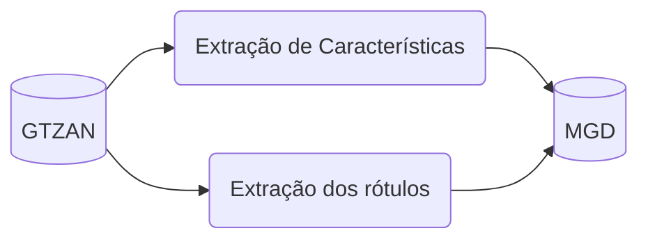

# Music Features Genre Dataset (MGD)

Esse repositório contém os códigos utilizados para o processamento do MGD, um dataset utilizado para a classificação de musicas em gêneros. 

Em particular, MGD é constituído por características musicais e anotações de 10 gêneros das músicas presentes no [GTZAN](https://www.tensorflow.org/datasets/catalog/gtzan).

A figura a seguir define as etapas de processamento para a obtenção do MGD. Inicialmente, $100$ músicas de cada gênero (totalizando $1000$ músicas) são obtidas nos datasets do GTZAN e MSD. Em seguida, todas as músicas são processadas para terem 30 segundos de duração e é realizada a etapa de extração das características. Por último, os rótulos com os gêneros são extraídos e combinados com as características para criação do MGD.

Os próximos sub-tópicos descrevem brevemente a abordagem utilizada em cada uma das etapas. Uma discussão aprofundada será disponibilizada no relatório final produzido.

## GTZAN

O GTZAN consiste em $1000$ músicas (*audio tracks*) com 30 segundos de duração classificadas em $10$ gêneros ($100$ músicas por gênero): blues, classical, country, disco, hiphop, jazz, metal, pop, reggae, rock.

## Extração de Características

Selecionamos $21$ características comumente utilizadas na literatura para classificação de gêneros musicais e utilizamos a biblioteca `librosa` para extração delas nos $30$ segundos de áudio.

As características extraídas foram as seguintes:

- A média normalizada dos primeiros 12 **Mel-frequency cepstral coefficients** (MFCCs);
- A média normalizada do **Spectral Flatness** (SF);
- A média normalizada do **Spectral Centroid** (SC);
- A média normalizada do **Spectral Roll-off** (SR)
- A média normalizada das 6 dimensões do **Tonnetz**;

O cálculo de tais características consiste em "quebrar" o arquivo de áudio original em múltiplos *frames* e calcular os valores para cada um desses frames, em seguida calculamos a média e normalizamos os resultados para obter uma característica agregada dos $30$ segundos.

## Extração dos Rótulos

Em paralelo à etapa de extração de características, obtemos o rótulo original do gênero dessa música.
