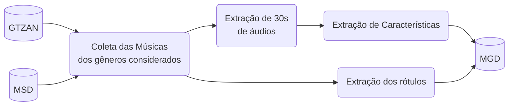

# Music Genre Dataset (MGD)

Esse repositório contém os códigos utilizados para o processamento do MGD, um dataset utilizado para a classificação de musicas em gêneros. 

Em particular, MGD é constituído por características musicais e anotações de 5 gêneros (Clássica, Eletrônica, Hip Hop, Pop, e Rock) das músicas presentes no [GTZAN](https://www.tensorflow.org/datasets/catalog/gtzan) e [Million Song Dataset](http://millionsongdataset.com/) (MSD) com anotações do [tagtraum](https://www.tagtraum.com/msd_genre_datasets.html).

A figura a seguir define as etapas de processamento para a obtenção do MGD. Inicialmente, $200$ músicas de cada gênero (totalizando $1000$ músicas) são obtidas nos datasets do GTZAN e MSD. Em seguida, todas as músicas são processadas para terem 30 segundos de duração e é realizada a etapa de extração das características. Por último, os rótulos com os gêneros são extraídos e combinados com as características para criação do MGD.

## GTZAN

## MSD com tagtraum

## Características consideradas

- 12 MFCCs
- Spectral Flatness (SF)
- Spectral Centroid (SC)
- Spectral Roll-off (SR)
- Tonnetz