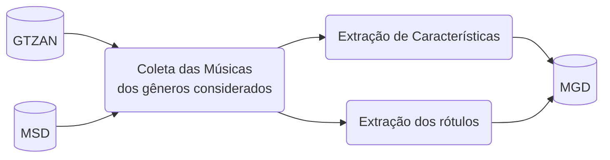

# Music Genre Dataset (MGD)

Esse repositório contém os códigos utilizados para o processamento do MGD, um dataset utilizado para a classificação de musicas em gêneros. 

Em particular, MGD é constituído por características musicais e anotações de 5 gêneros (Clássica, Eletrônica, Hip Hop, Pop, e Rock) das músicas presentes no [GTZAN](https://www.tensorflow.org/datasets/catalog/gtzan) e [Million Song Dataset](http://millionsongdataset.com/) (MSD) com anotações do [tagtraum](https://www.tagtraum.com/msd_genre_datasets.html).

A figura a seguir define as etapas de processamento para a obtenção do MGD. Inicialmente, $200$ músicas de cada gênero (totalizando $1000$ músicas) são obtidas nos datasets do GTZAN e MSD. Em seguida, todas as músicas são processadas para terem 30 segundos de duração e é realizada a etapa de extração das características. Por último, os rótulos com os gêneros são extraídos e combinados com as características para criação do MGD.

Os próximos sub-tópicos descrevem brevemente a abordagem utilizada em cada uma das etapas. Uma discussão aprofundada será disponibilizada no relatório final produzido.

## GTZAN

O GTZAN consiste em $1000$ músicas (*audio tracks*) com 30 segundos de duração classificadas em $10$ gêneros ($100$ músicas por gênero): blues, classical, country, disco, hiphop, jazz, metal, pop, reggae, rock.

## MSD com tagtraum

TODO: Adicionar descrição.

## Coleta das Músicas

As músicas foram coletadas da seguinte forma:

- Para o GTZAN, selecionamos $100$ músicas de 4 dos 5 gêneros considerados. Ou seja, coletamos todas as músicas desse gênero.
  - Utilizamos a versão disponibilizada pelo [TensorFlow](https://www.tensorflow.org/datasets/catalog/gtzan) nessa etapa.
- Para o MSD, selecionamos músicas do gênero restante buscando linearmente nas anotações do *tagtraum* (iniciando no topo documento e descendo linha a linha até colocar as músicas faltantes para cada gênero). Depois, obtivemos arquivos de áudio com 30s através dos previews do 7Digital e Spotify.
  - As anotações do *tagtraum* mapeiam IDs das músicas no *Echo Nest* para gêneros e sub-gêneros.
  -  O [Million Song Dataset Echo Nest mapping archive](https://labs.acousticbrainz.org/million-song-dataset-echonest-archive/) mapeia IDs de músicas no *Echo Nest* para IDs de outros serviços como *Spotify* e *7Digital*.
  - Dessa forma, utilizamos ambas ferramentas para obter os arquivos das músicas classificadas nos gêneros selecionados.

Ao final da coleta, obtivemos um total de $1000$ arquivos de música com 30 segundos de duração classificados nos 5 gêneros ($200$ arquivos para cada). 

## Extração de Características

Selecionamos $21$ características comumente utilizadas na literatura para classificação de gêneros musicais e utilizamos a biblioteca `librosa` para extração delas nos $30$ segundos de áudio.

As características extraídas foram as seguintes:

- A média normalizada dos primeiros 12 **Mel-frequency cepstral coefficients** (MFCCs);
- A média normalizada do **Spectral Flatness** (SF);
- A média normalizada do **Spectral Centroid** (SC);
- A média normalizada do **Spectral Roll-off** (SR)
- A média normalizada das 6 dimensões do **Tonnetz**;

O cálculo de tais características consiste em "quebrar" o arquivo de áudio original em múltiplos *frames* e calcular os valores para cada um desses frames, em seguida calculamos a média para a música como um todo e normalizamos os resultados.

## Extração dos Rótulos

Em paralelo à etapa de extração de características, obtemos o rótulo original do gênero dessa música.

Para manter um padrão no novo dataset, utilizamos os seguintes rótulos para os gêneros de classificação:

- 0: Clássica;
- 1: Hip-Hop;
- 2: Eletrônica;
- 3: Pop;
- 4: Rock;

Visto que as anotações do GTZAN e MSD + tagtraum são diferentes, realizamos um mapeamento para os rótulos acima sempre que necessário.

## Agregação no dataset final

Por último, adicionamos uma nova *linha* no dataset contendo o rótulo e as características extraídas da música atual. Em adição, também adicionamos metadados acerca do dataset de origem (GTZAN ou MSD) e seu identificador nesse dataset (nome do arquivo para o GTZAN, *Echo Nest ID* para o MSD).

O dataset é criado e disponibilizado utilizando o *TensorFlow Datasets*.
